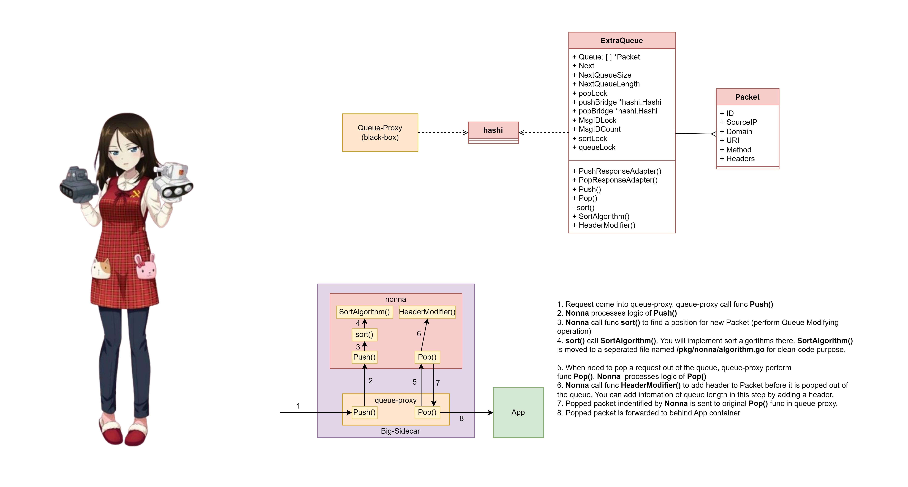

# Nonna - Нонна - ノンナ

### (Blizzard Nonna - Bão Tuyết Nonna - ブリザードのノンナ)

[]()
[](https://www.apache.org/licenses/LICENSE-2.0)

[](https://kubernetes.io/)
[]()
[](https://knative.dev/docs/)
[](https://go.dev/)
[](https://protobuf.dev/)

`Nonna` is the Queue Modifier Module of the [ikukantai Fleet](https://github.com/bonavadeur/ikukantai)


## 1. Motivation

`nonna` supports deploying Queue-Modifying Algorithm in `ikukantai` Fleet without deeping into Knative source code.

`nonna` is actually **Knative Queue-Proxy** underneath. In the Vanilla Knative Serving, The queueing model implemented in Queue-Proxy is FIFO Queue. Although FIFO is a simple queueing model, it is not the most optimal queueing model in some complicated scenarios. By using `nonna`, you can implement your own priority queue that adopts parameters such as: **HTTP method**, **URI path**, **HTTP Header**, **Source IP address** and **Domain name**.

`nonna` also supports piggybacking based Load Balancer in the `ikukantai` Fleet along with [katyusha](https://github.com/bonavadeur/katyusha) by modifying HTTP header of responsed packets.

The name `nonna` is inspired by the character **Nonna** in the anime **Girls und Panzer**. `nonna` and [katyusha](https://github.com/bonavadeur/katyusha) form a complete Load Balancing system for the `ikukantai` Fleet. This Load Balancing system uses piggybacking mechanism to update load status as fast as possible, much like how **Nonna** always carries **Katyusha** on her back in anime **Girls und Panzer**.

## 2. Structure



## 3. Installation

### 3.1. Requirement

+ [ikukantai](https://github.com/bonavadeur/ikukantai?tab=readme-ov-file#3-installation) Fleet is deployed, version >= 2.1
+ [Go](https://go.dev/doc/install) is installed, version >= 1.22.4
+ [Docker]() is installed. `docker` command can be invoked without sudo
+ [upx](https://upx.github.io/) is installed, version >= 4.2.4

### 3.2. Config `nonna` as image of queue-proxy

Edit Custom Resource **Image**.**caching.internal.knative.dev/v1alpha1** and Configmap **config-deployment** in namespace **knative-serving** to change image for queue-proxy to `nonna`, see [replace-image.sh](hack/replace-image.sh)

```bash
$ chmod +x hack/replace-image.sh
$ ./hack/replace-image.sh
```

### 3.3. Add configs to Configmap for Nonna

`nonna` uses these configs in ConfigMap **config-ikukantai** in namespace **knative-serving**:

| Config | Description | Value | Example |
|-|-|-|-|
| **ikukantai-enable-nonna** | enable/disable `nonna` | bool | "true", "false" |
| **nonna-threads** | number of processing threads in `nonna` | integer | "10" |

Example:

```yaml
apiVersion: v1
kind: ConfigMap
metadata:
  name: config-ikukantai
  namespace: knative-serving
...
data:
  ...
  ikukantai-enable-nonna: 'true'
  nonna-threads: '10'
  ...
```

## 4. Development

First, apply a demo application for `nonna` development:

```bash
$ kubectl apply -f config/hello.yaml
```

Make sure `nonna` is injected into the Pod:

```bash
$ kubectl get pod | grep hello
hello-00001-deployment-598589db69-bhwhv                  2/2     Running   0              26m

$ kubectl get pod hello-00001-deployment-598589db69-bhwhv -o yaml | grep image:
    image: index.docker.io/bonavadeur/shuka@sha256:92b17a46559202b3584a3e9e1373914ed0e66bc55ba6d3a1353312dae25de79b
    image: docker.io/bonavadeur/nonna:dev
    image: docker.io/bonavadeur/nonna:dev
    image: sha256:79054189220aa9f84fac527b4069f4ed17b6de4e6713d5d58ccfe06a17ea0dd6
```

Take a look in [build.sh](./build.sh). There are two options for building `nonna` image:
+ **ful**: build `nonna` image from source, fastly but large size of image
+ **push**: like **ful** options, but slower and smaller size of image because the compression level is increased and then image will be pushed to the registry

```bash
$ ./build.sh ful # faster but larger image size
$ ./build.sh push # slower but smaller image size
```

## 5. Author

Đào Hiệp - Bonavadeur - ボナちゃん  
The Future Internet Laboratory, Room E711 C7 Building, Hanoi University of Science and Technology, Vietnam.  
未来のインターネット研究室, C7 の E ７１１、ハノイ百科大学、ベトナム。  


